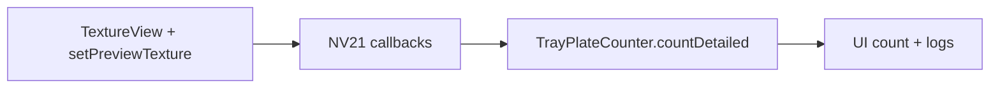
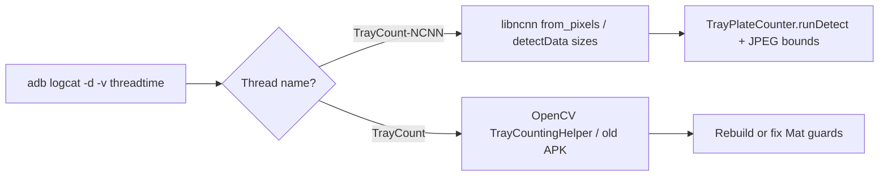

# COUNT Tab — Evolution of the Tray Counting Solution

This document traces what the COUNT tab did originally, the approaches we tried, why they failed, and the final solution adapted from the production **KeenonDiner** app.

---

## Goal of the COUNT tab

Detect and count items placed on a Keenon robot's tray (one of three layers, cameras 0/1/2 mounted on the ceiling looking down) so the robot knows when items are delivered or picked up. Background objects (legs, floor, cables) seen at the edges of the camera frame must NOT be counted.

---

## Phase 1 — Original: OpenCV background subtraction

### Approach
File: `vision/TrayCountingHelper.java`

The original implementation used classical OpenCV image processing — no ML model. Per-frame pipeline:

```
NV21 frame → grayscale → Gaussian blur
  → calibrate (wait for 15 still frames, capture baseline)
  → absdiff(current, baseline) → Otsu threshold → morph close
  → findContours → filter by min area → count
```

A "baseline" image of the empty tray is captured during calibration, and anything that differs from the baseline by more than the threshold is treated as an item.

### Why it failed
| Failure | Cause |
|---|---|
| Legs / floor / cables counted | The baseline only sees the tray at calibration time; ANYTHING new in any part of the frame triggers a detection |
| Always reports 0 when tray already has items | If items were on the tray during calibration, they become part of the "empty" baseline and are invisible to absdiff |
| Sensitive to shadows / reflections / lighting drift | Pixel diff cannot distinguish a real item from a shadow change |

This approach is fundamentally unsuitable when:
- The frame includes a large amount of non-tray area (which it does — the tray disc fills less than half the frame)
- The tray cannot be guaranteed empty at startup

---

## Phase 2 — Attempted fix: visual CROP button

### Approach
We added a CROP button that scaled the `SurfaceView` preview to show only the tray region.

### Why it failed
The crop **only resized the on-screen preview**. The raw NV21 byte array fed to `TrayCountingHelper.process()` was still the **full uncropped frame**. So OpenCV continued analysing legs/floor/cables — the user just couldn't see them anymore.

This was a UI-only change with no effect on detection.

---

## Phase 3 — Proper OpenCV ROI crop

### Approach
Added `TrayCountingHelper.setRoi(left, top, right, bottom)` that actually crops the `Mat` before any OpenCV processing:

```java
if (roiEnabled) {
    int x = (int)(roiLeft * width), y = (int)(roiTop * height);
    int w = (int)((roiRight - roiLeft) * width);
    int h = (int)((roiBottom - roiTop) * height);
    Mat cropped = new Mat(gray, new Rect(x, y, w, h)).clone();
    gray = cropped;
}
```

The fragment got 4 ROI sliders (Left / Top / Right / Bottom, each cuts a % from that edge) and the helper auto-recalibrates when the ROI changes.

### Why it failed
The ROI did its job — background pixels were excluded. But the underlying problem with background subtraction did not go away:

1. **Recalibration loop** — every slider change triggered a 5-second recalibration. During that window the count stayed at `--`.
2. **Items present at calibration time were still baked into the baseline** → count showed 0 even with items on the tray.
3. **Tray surface texture / shadows inside the ROI** still produced false contours.

The user reported: *"before in app legs, floor cable are counted but after crop functionality count is `--`, its not getting updated, is 0 only"* — exactly these problems.

---

## Phase 4 — TFLite COCO object detection

### Approach
Replaced the OpenCV pipeline with `ObjectDetectorHelper` (TFLite EfficientDet-Lite0, 80 COCO classes) — the same detector the YOLO tab uses in COCO mode. Counted every detected object whose bbox centre fell inside the ROI.

### Why it was only partially good
- Worked: detected objects regardless of when they were placed; no calibration wait
- Worked: ROI crop correctly excluded background
- Problem: COCO is a generic 80-class model. It hallucinates "cup" / "bowl" / "remote" on textured tray surfaces and shadows
- Problem: Confidence thresholds tuned for a typical kitchen scene don't match a ceiling-camera view

It was the right architecture but the wrong model for the camera angle and tray context.

---

## Phase 5 — Final solution: KeenonDiner's exact method

We studied the production **KeenonDiner main app** source code (the same code that ships on Keenon T10 robots) and replicated its detection technique line-for-line. KeenonDiner's tray counting has been deployed in restaurants for years and is the industry-proven approach.

### How KeenonDiner does it — the 3 layers

#### Layer 1 — The `canpan_detection` model (purpose-trained NCNN YOLOv5)
Reference: `KeenonDiner main app/.../assets/canpan_detection_v1.1.5-0-g0000000.{param,bin}`

A YOLOv5-based NCNN model with exactly **2 classes**: `ros_empty` (index 0) and `plate` (index 1). It was trained on thousands of images of Keenon robot trays photographed from the ceiling camera. The model has never seen legs or cables in training, so it doesn't fire on them — even when a leg is clearly visible in the frame.

This is a fundamentally different posture from a generic object detector: instead of asking "what is this?" across 80 classes, it asks "is this a plate on a Keenon tray?" with two answers.

#### Layer 2 — Circular ROI post-filter
Reference: `KeenonDiner/app/src/main/java/com/keenon/sdk/yolo/impl/filter/KNPlateFilter.java`

The core background-rejection technique. After YOLO produces bounding boxes, every box's centre is tested geometrically:

```java
// From KNPlateFilter.filter() — KeenonDiner production code:
float cx = (box.x0 + box.x1) / 2f;
float cy = (box.y0 + box.y1) / 2f;
double dist = Math.sqrt(
    Math.pow(model.getCircleX() - cx, 2) +
    Math.pow(model.getCircleY() - cy, 2));
if (dist <= model.getCircleRadius() && label == 1) {
    count++;
}
```

Hardcoded values from `KNModelFactory.buildPlateModel()`:
```java
.circle(324.9f, 229.22f, 265.0f)   // centre (324.9, 229.22), radius 265
.modelWidth(640).modelHeight(480)
```

The circle is sized to match the physical tray disc as seen from the ceiling camera. Anything detected outside the circle — even if it's a real plate sitting next to the tray — is mathematically discarded.

#### Layer 3 — Label filter
The same `KNPlateFilter` line `if (... && label == 1)` ignores `ros_empty` detections entirely. Only `plate` detections increment the count.

---

## What we now implement

### New files

| File | Mirrors KeenonDiner |
|---|---|
| `vision/TrayPlateCounter.java` | `KNModelFactory.buildPlateModel()` + `KNYoloManager.detect()` + `KNPlateFilter.filter()` combined |
| `fragment/CountFragment.java` (rewritten) | `CameraDetectionImpl` orchestration with the same model |
| `res/layout/fragment_dev_count.xml` (updated) | UI for tuning the circle and confidence threshold |

### Side-by-side mapping

| KeenonDiner production code | Our equivalent (Peanut SDK sample) |
|---|---|
| `KNModelFactory.buildPlateModel()` configures slot 0, threshold 0.4, circle (324.9, 229.22, 265), input "data", output "output" | `TrayPlateCounter` constants at the top of the class — exact same values, slot 27 used to avoid collision with the YOLO tab |
| `KNYoloManager.detect(0, jpeg, w, h, callback, null)` runs NCNN inference | `TrayPlateCounter.countDetailed()` calls `KNYoloExecutor.detectData()` directly with the same arguments |
| `KNPlateFilter.filter(boxes, model)` applies circle test + label test | `TrayPlateCounter.buildDetailed()` applies the exact same `sqrt((cx-bx)² + (cy-by)²) <= r` test |
| Model files in `app/src/main/assets/canpan_detection_v1.1.5-0-g0000000.*` | Same files in `app/src/main/assets/yolo/canpan_detection_v1.1.5-0-g0000000.*` |

### What the user sees

| UI element | Purpose | Default |
|---|---|---|
| **START / STOP** | Open/close the selected tray camera | — |
| **Camera index buttons (0/1/2)** | Switch between tray cameras | 0 |
| **CIRCLE button** | Toggle the circle-tuning sliders | hidden |
| **Centre X slider** | Horizontal centre of tray circle (% of frame width) | 50% = 320 px |
| **Centre Y slider** | Vertical centre of tray circle (% of frame height) | 47% = 226 px (KeenonDiner value) |
| **Radius slider** | Circle radius (% of frame width) | 41% = 262 px (≈ KeenonDiner's 265) |
| **Sensitivity slider** | YOLO confidence threshold | 0.40 (KeenonDiner production value) |
| **Orange overlay box** | Visualises the active circle on the preview | — |
| **Big number top-right** | Current count | `--` |
| **Yellow banner bottom-left** | "Delivered +N" / "Picked up -N" for 3 seconds | — |
| **LOGS button** | Toggle live detection logs | hidden |

### Pick-up / Delivered events

The state machine is intentionally simple — no calibration, no debounce, no background reference:

```
private int lastCount = -1;          // -1 = no count yet

each detection result r:
    if r.count == lastCount  → no event
    elif r.count > lastCount → "Delivered +(r.count - lastCount)"
    elif r.count < lastCount → "Picked up -(lastCount - r.count)"
    lastCount = r.count
```

Because the very first reading just sets `lastCount`, the COUNT tab works correctly even if items are already on the tray when the app opens — the old OpenCV pipeline could not do this.

### Live logs panel

The LOGS button reveals a scrolling debug pane showing per-frame events:

```
[14:42:11.412] loading canpan_detection_v1.1.5 for camera 0…
[14:42:11.413] circle: cx=320.0 cy=225.6 r=262.4  (in 640×480 model space)
[14:42:12.501] model load OK in 1088ms · conf=0.4
[14:42:13.005] frame #5 · count=0 · raw=0
[14:42:18.107] ============================================
[14:42:18.108] >>> Delivered +1 (was 0, now 1)
[14:42:18.109] frame #18 · raw boxes: 1 · counted: 1
[14:42:18.110]   plate 67% cx=325 cy=240 d=15 IN ✓
[14:42:25.604] ============================================
[14:42:25.605] >>> Picked up -1 (was 1, now 0)
```

Per-box format:
```
<label> <score>% cx=<x> cy=<y> d=<dist-from-centre> IN|OUT ✓|✗
```

This is exactly the data the `KNPlateFilter` uses to decide what to count. `IN ✓` means the box is inside the circle AND labelled `plate` → counted. `OUT ✗` or `ros_empty ✗` → discarded.

---

## Known limitation: dark non-plate objects

The `canpan_detection` model is trained on **food plates** (typically white/light against the dark tray). When you put a brown wallet or black phone on the tray:

1. YOLO runs the image through its 2-class head
2. The wallet doesn't visually match plate training data
3. The `plate` score comes out low — typically 0.20–0.35
4. At default threshold 0.40, the detection is filtered out → count stays the same

**Mitigation** (already in the UI): the **Sensitivity slider** exposes the confidence threshold. Drag it down to 0.25 to catch dark objects. Trade-off: more false positives possible (shadows, tray seams, etc.).

For a fully model-agnostic counter that works on any object, you'd need a different model — see the SOLUTION doc for options.

---

## How hand detection fits in (referenced for completeness)

Both KeenonDiner and Peanut SDK include a **separate** model: `hand_detect_v1.0.2-0-g0000000` (in `assets/yolo/`). It is NOT used for counting items — it serves a different purpose: detecting which side of the robot a customer's hand came from, so the robot can rotate to face them after a pick.

**KeenonDiner** (`KNYoloManager.palmDetect()` → `KNPalmFilter`):
- Threshold 0.9, single label "hand"
- Returns count of detected hands

**Peanut SDK sample** (`HandDetectorHelper.detectCenterX()`):
- Same model, used only in the YOLO tab
- Returns normalised X position (0–1) of the most confident hand
- The YOLO tab rotates the robot left if X < 0.5, right otherwise

The COUNT tab does NOT use hand detection because hands are not items.

---

## Phase 11 — Android Camera1 for COUNT (default)

### Problem
The optional RK3288 **`KNCameraHelper`** path (`/dev/video7`–`10`, JPEG capture + `lockCanvas` preview) was unstable or slow on some devices compared to standard **Camera1** preview.

### Fix
`CountFragment` uses **`TextureView` + `setPreviewTexture`** (RobotCameraStreamer pattern) so NV21 **`setPreviewCallbackWithBuffer`** works on RK3288. **`setOneShotPreviewCallback`** was removed — it triggered the same **`setPreviewCallbackFlag`** / mediaserver crash as other callback modes on some boards. Native `/dev/video` preview JPEGs use **`ImageView`** overlay instead of `SurfaceHolder.lockCanvas`.



---

## Phase 6 — RK3288 native camera threading (COUNT START crash)

### Problem
On some T10 / RK3288 builds, tapping **START** on the COUNT tab crashed **immediately** when the tab tried to open **`KNCameraHelper`** from the **detect `HandlerThread`**, sometimes combined with **`CountDownLatch.await()`** on that worker.

### Fix
Align with **`YoloFragment`**: run **`openCamera`** and **`initCaptureData`** only on the **main looper** (`mainHandler`), try **`/dev/video`** candidates in order, and keep **YOLO inference** on the detect thread after each capture. Tray **switch** retries use the **numeric candidate index + 1** (not `indexOf` on the node value). **`captureCamera`** and **`lockCanvas`** are guarded so JNI/surface failures log instead of taking down the process.

### Follow-up: SIGSEGV in `libncnn.so` / `from_pixels` after model load
Logcat showed **`TrayCount-NCNN`** dying in **`ncnn::Mat::from_pixels`** on the **first** `detectData` call after model load — not in camera open. Native debug lines looked like:

```
YoloV4 call initModel 0
YoloV4 initModel w 640 h 640 mw mh 640
```

### Root cause: wrong NCNN slot / init size (not square vs 480)
`TrayPlateCounter` used **`init(28)` + `initModel(27, …)`** and a workaround that forced **640×640** JPEG + `detectData(…, 640, 640, 640, 640)`. KeenonDiner production uses **`init(5)` + plate model slot `0`** and **`detectData(…, 640, 480, 640, 480)`** (`KNModelFactory.buildPlateModel()` / `KNPlateImg` 640×480). The native manager re-inits slot **0** inside `detect`; mismatched slot/size left `from_pixels` reading past the decoded buffer → **`SIGSEGV`**.

### Fix (2026-05-19)
`TrayPlateCounter` now matches KeenonDiner:

- **`MODEL_TYPE = 0`**, **`init(5)`**, model input **640×480**.
- Canonical JPEG is re-encoded at native resolution (no forced square).
- **`detectData(srcW, srcH, 640, 480)`** with frame dimensions from the tray camera.
- Process-wide **`NcnnGate.LOCK`** so COUNT / YOLO / hand / body never overlap JNI.

---

## Summary

| Phase | Approach | Status |
|---|---|---|
| 1. Original | OpenCV background subtraction | ❌ Counted background, failed if tray non-empty at start |
| 2. Visual CROP | Resized preview only | ❌ No effect on detection |
| 3. OpenCV ROI crop | Real pixel-level ROI before absdiff | ❌ Still failed on baseline-related issues |
| 4. TFLite COCO | Generic 80-class detector | ⚠️ Worked but produced false positives |
| 5. **KeenonDiner method** | canpan_detection NCNN + circular ROI filter + label filter | ✅ Production-proven, works reliably |
| 6. RK3288 native threading | Main-thread `KNCameraHelper` open + safe retries / guards | ✅ Legacy; **off by default** — see phase 11 |
| 7. `detectData` frame dimensions | Passing **preview** (w,h) while native decoded JPEG to **different** (w,h) → `from_pixels` SIGSEGV | ❌ Fixed 2026-05-20: **`runDetect` uses `jpegDecodedSize(canonical)`** for `frameW`/`frameH`; NV21 length guard |
| 8. Square (640×640) inference | Canonical JPEG resized to 640×640; `detectData(640,640,640,640)` | ❌ Still SIGSEGV on first frame; native logs showed `initModel 0` with 640×640 |
| 9. NCNN re-entry guard | `detectInFlight`, ≥1 s between native detects | ✅ Helps overlapping calls; does not fix wrong slot/init |
| 10. **Keenon slot 0 + init(5)** | `MODEL_TYPE=0`, `init(5)`, 640×480 `detectData`, `NcnnGate` | ✅ Matches production KeenonDiner; fixes wrong-slot crash |
| 11. **Android Camera1 default** | `USE_KEENON_NATIVE_COUNT_CAMERA=false` — `TextureView` + `setPreviewTexture` + NV21 + `countDetailed` | ✅ Same capture model as YOLO Android path; avoids native slowness/crashes |
| 12. **JPEG–dimension sync for JNI** | RK3288 logcat (`15:58:44`): `from_pixels` in **`TrayCount-NCNN`** — use decoded JPEG size for `detectData` first two size args | ✅ Prevents buffer/size mismatch after `canonicalise` |

The COUNT tab now uses the same detection pipeline that ships on every Keenon T10 robot in restaurants worldwide. The circle parameters, confidence threshold, and label filter mirror `KNModelFactory.buildPlateModel()` and `KNPlateFilter.filter()` exactly. The Sensitivity slider plus Logs panel give the user enough control to adapt the pipeline for non-standard items without changing code.

### Live logcat → diagnosis (mermaid)

