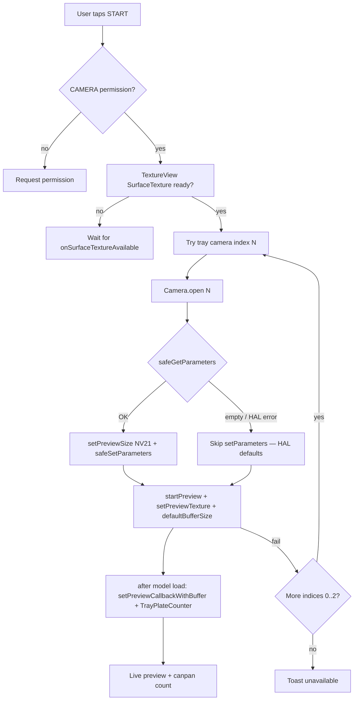
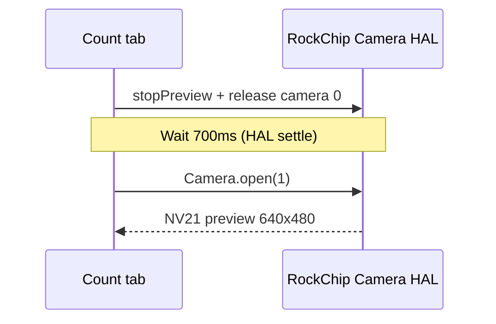

# COUNT Tab — Tray Item Counting Solution

## Problem

The original COUNT tab used **OpenCV background subtraction** (`TrayCountingHelper`) which failed for our use case:

| Failure mode | Cause |
|---|---|
| Background objects (legs, floor, cables) counted as items | OpenCV diffs against a captured baseline; anything different from baseline counts |
| Count stuck at `--` after enabling CROP | Crop only resized the preview, not the actual pixels fed to OpenCV; baseline was on full frame |
| Always reports 0 when tray starts with items | Baseline captures items as part of the empty-tray reference; they become invisible |
| Sensitive to shadows / reflections on the dark tray surface | Pixel-diff approach cannot distinguish object from lighting change |

## Solution — Use KeenonDiner's exact detection method

KeenonDiner's production app solves this with a 3-layer system. We replicated it identically in the COUNT tab.

### Layer 1 — Purpose-trained NCNN model
File: `assets/yolo/canpan_detection_v1.1.5-0-g0000000.{param,bin}` (extracted from KeenonDiner)

The model has 2 classes: `ros_empty` (index 0) and `plate` (index 1). It was trained on ceiling-camera images of Keenon robot trays — it has never seen legs/cables/floor in training, so it naturally ignores them. This is the foundation; the other 2 layers exist to catch the cases the model alone would miss.

### Layer 2 — Circular ROI post-filter
The killer feature. Source: `KNPlateFilter.java` (KeenonDiner). After YOLO produces bounding boxes, every box is geometrically tested:

```
distance = sqrt( (circleX - box_centre_x)² + (circleY - box_centre_y)² )
KEEP only if:  distance ≤ circleRadius   AND   label == 1 ("plate")
```

KeenonDiner's hard-coded values for the T10 ceiling camera:
- Circle centre: `(324.9, 229.22)` — slightly right-of-mid, slightly above mid (in 640×480 space)
- Radius: `265 px` for standard plates, `285 px` for UK variants

Anything detected outside this circle is mathematically discarded. The circle matches the physical tray disc as seen from above.

### Layer 3 — Label filter
Only label index 1 (`plate`) is counted. Label 0 (`ros_empty`) is ignored even when it scores above threshold.

## Files added / modified

| Path | Purpose |
|---|---|
| `vision/TrayPlateCounter.java` | NEW — runs canpan_detection through `KNYoloExecutor` and applies the circle + label filter |
| `fragment/CountFragment.java` | REWRITTEN — uses `TrayPlateCounter`, replaces the broken OpenCV pipeline, adds Circle/Sensitivity/Logs UI |
| `res/layout/fragment_dev_count.xml` | UPDATED — added Circle panel, Sensitivity slider, Logs panel, CIRCLE/LOGS buttons |

## UI Controls

### Buttons
| Button | Action |
|---|---|
| `START` | Open the selected tray camera and load the model |
| `STOP` | Close the camera |
| `CIRCLE` | Toggle the circle-tuning sliders panel |
| `LOGS` | Toggle the live detection logs panel |

### Circle panel (CIRCLE button)
| Slider | Range | Meaning |
|---|---|---|
| Centre X | 0–100% | Horizontal centre of the tray disc, as % of frame width. Default 50% (= 320 in 640px frame) |
| Centre Y | 0–100% | Vertical centre. Default 47% (= 226 in 480px frame, matches KeenonDiner) |
| Radius   | 0–60%  | Circle radius, as % of frame width. Default 41% (= 262, ≈ KeenonDiner's 265) |
| Sensitivity | 0.10–0.90 | YOLO confidence threshold. Default 0.40 (KeenonDiner production) |

### Why a Sensitivity slider exists
The canpan model was trained on **food plates** — typically white/light ceramic against the dark tray. When users put non-plate objects on the tray:

- **Light objects** (cups, packets, mobile phones with light screens) → usually score `≥ 0.40` → detected at default sensitivity
- **Dark objects** (brown wallet, black phone, dark bowl) → score lower (often `0.20–0.35`) because they don't match plate training data

Lower the Sensitivity slider to `0.25` or `0.20` to catch dark objects. Trade-off: more false positives (shadows, tray patterns) may sneak in. Tune per environment.

For best results on a varied set of objects, KeenonDiner uses additional models (body, hand) — see "Future improvements" below.

### Live Logs panel (LOGS button)
Shows real-time detection events with timestamps:

```
[14:42:11.412] loading canpan_detection_v1.1.5 for camera 0…
[14:42:11.413] circle: cx=320.0 cy=225.6 r=262.4  (in 640×480 model space)
[14:42:12.501] model load OK in 1088ms · conf=0.4
[14:42:13.005] frame #5 · count=0 · raw=0
[14:42:18.107] ============================================
[14:42:18.108] >>> Delivered +1 (was 0, now 1)
[14:42:18.109] frame #18 · raw boxes: 1 · counted: 1
[14:42:18.110]   plate 67% cx=325 cy=240 d=15 IN ✓
[14:42:25.604] ============================================
[14:42:25.605] >>> Picked up -1 (was 1, now 0)
[14:42:25.606] frame #43 · raw boxes: 0 · counted: 0
[14:42:25.606]   no raw boxes
```

#### Per-box log line format
```
<label> <score>% cx=<x> cy=<y> d=<dist-from-centre> IN|OUT ✓|✗
```
- `label` — `plate` or `ros_empty` (whichever class YOLO assigned)
- `score%` — model confidence, 0–100
- `cx,cy` — box centre in 640×480 model coordinates
- `d` — pixel distance from circle centre (Euclidean)
- `IN` / `OUT` — whether the centre is inside the circle
- `✓` — counted (IN + plate) · `✗` — discarded

This is exactly the data KeenonDiner's `KNPlateFilter` uses for its decision.

## How pick-up / delivered events work

State machine in `CountFragment.renderCount()`:

```
private int lastCount = -1;     // -1 = no count yet

on each detection result r:
    if r.count == lastCount  → no event
    elif r.count > lastCount → DELIVERED (+(r.count - lastCount))
    elif r.count < lastCount → PICKED UP (-(lastCount - r.count))
    lastCount = r.count
```

When `lastCount` is `-1` (very first frame), no event fires — we just record the starting count. This means **the COUNT tab works correctly even if the tray starts with items already on it**, unlike the old OpenCV approach which would have baked them into the baseline.

Events show as a yellow banner at the bottom of the preview for 3 seconds, AND get a full breakdown in the Logs panel.

## How the model is invoked (technical flow)

```
Android Camera → NV21 preview callback (640×480, ~3 fps throttled to ~2 fps)
              ↓
TrayPlateCounter.countDetailed(nv21, w, h)
              ↓
   nv21ToJpeg() — YuvImage.compressToJpeg at quality 85
              ↓
   canonicalise() — decode + re-encode to ensure clean JPEG markers
              ↓
   synchronized (NcnnGate.LOCK) {
     KNYoloExecutor.detectData(
       type=0, jpeg, jpeg.length,       ← KeenonDiner YOLO_MODEL_PLATE slot
       confThreshold,                    ← Sensitivity slider
       paramPath, binPath,
       "data", 0, "output",              ← model input/output layer names
       srcW=640, srcH=480, modelW=640, modelH=480)
   }
   // executor.init(5) once at load — same as KNYoloManager.setModelSize(5)
              ↓
   KNBox[] (native NCNN inference)
              ↓
   buildDetailed() — circle filter + label filter, builds log lines
              ↓
CountResult { count, rawBoxCount, logLines }
              ↓
mainHandler → renderCount() → bigNumber, statusLine, logs
```

Detection runs on a background `HandlerThread` (`TrayCount-NCNN`) at 500 ms minimum interval. The preview callback drops frames that arrive while a previous detection is still in flight, so the UI never lags.

## Hand detection — how Keenon uses it

> Question asked: "for hand detection what have keenon dinor app or peanut service app used?"

Both apps include a separate model: `hand_detect_v1.0.2-0-g0000000` (in `assets/yolo/`). It is NOT used for counting — it's used to detect the **direction of a pick** so the robot can rotate to face the customer.

### KeenonDiner production flow (`KNYoloManager.palmDetect`)
```
Model slot: 4 (YOLO_MODEL_PALM)
Threshold: 0.9 (very high — Keenon found this model over-fires at lower values)
Labels:   ["hand"]
Filter:   KNPalmFilter — just counts boxes that pass threshold
Input layer: "data"  Output layer: "output"
Model dimensions: 640×480
```

Called from `ResultAnalyseHelper.java` when `mActionDetectionType == 1` (ACTION_HAND mode):
```java
KNHelper.palmDetect(frame, length, 10, callback);
```
The callback returns a count of detected hands.

### Peanut SampleApp flow (`HandDetectorHelper.java`)
Used **only in the YOLO tab**, NOT in COUNT. When the plate count drops:

1. `YoloFragment` notes the disappearing item's bbox centre-X (`lastItemDisappearX`)
2. If `HandDetectorHelper.isReady()`, it overrides that with the real hand position:
   ```java
   float hx = handDetector.detectCenterX(frameJpeg, srcWidth, srcHeight);
   if (hx >= 0) lastItemDisappearX = hx;
   ```
3. The robot then rotates left/right based on `centerX < 0.5` vs `≥ 0.5`
4. After the rotation, body_detection (camera 3) confirms a person is in front
5. A star-rating dialog appears for feedback

### Should COUNT use hand detection?
Not for counting itself — hands are not items. The use case for hand detection is **directional action**:
- After a pick is detected, you want the robot to face the customer
- Hand position tells you which side the customer is on (left/right of robot)

If we ever wire COUNT to the robot rotation API, we'd add `HandDetectorHelper` to it exactly the way `YoloFragment` already does.

## Why the brown wallet is not detected

The canpan_detection model is **not a generic object detector**. It only knows two classes: `ros_empty` and `plate`. When you put a brown wallet on the tray:

1. YOLO runs the wallet image through its plate classifier head
2. The wallet doesn't visually match any plate the model was trained on
3. The "plate" class score comes out low — typically `0.10–0.30`
4. At default threshold `0.40`, the detection is filtered out

**Mitigations** in order of effort:

| Approach | Effort | Trade-off |
|---|---|---|
| Lower Sensitivity slider to 0.25 | Already supported — slider in UI | More false positives possible |
| Use COCO YOLOv5s model | Download `yolov5s.{param,bin}` to `assets/yolo/`; add a model-toggle button | 80 generic classes (bottle, cup, bowl, cell phone, book, …) — detects most objects but doesn't know "wallet" specifically |
| Custom-train a "tray item" model | High — need labelled dataset of wallets/keys/phones/bags on the tray | Best accuracy but takes weeks |

The COUNT tab's circle filter and event logic are **model-agnostic** — if you later swap in a different model file, the rest of the pipeline still works.

## Camera preview flow (COUNT tab)

COUNT uses **Android Camera1** with a **`TextureView`** and **`Camera.setPreviewTexture`** (same pattern as `RobotCameraStreamer`). NV21 frames arrive via **`setPreviewCallbackWithBuffer`**. A **`SurfaceView`** preview on RK3288 often never delivers callbacks; **`setOneShotPreviewCallback`** was removed because it can **SIGSEGV / kill mediaserver** on the same HAL. Optional native path draws JPEGs to **`count_native_overlay`** (`ImageView`).

Optional legacy path: `CountFragment.USE_KEENON_NATIVE_COUNT_CAMERA` (default `false`) can re-enable Keenon `KNCameraHelper` / `/dev/video*` on RK3288 for debugging only.



### RK3288 note (legacy native path)

Older builds routed COUNT through **`KNCameraHelper`** on `/dev/video7`–`10` because some RockChip HALs were fragile with **`setPreviewCallback`**. That path is **off by default** now. If you re-enable it and see `mediaserver` issues, switch back to Android-only (`USE_KEENON_NATIVE_COUNT_CAMERA = false`).

## Troubleshooting: "Camera open failed: get parameters failed (empty parameter)"

| Symptom | Cause | Fix |
|---|---|---|
| Toast with **empty parameter** on START | Keenon/RockChip HAL (`RK29_ICS_CameraHal`) sometimes throws on `Camera.getParameters()` for a given index; older COUNT tab called it without a guard | Rebuild/install SampleApp with `CountFragment` safe camera helpers (same pattern as Developer → **Camera** tab and `RobotCameraStreamer`) |
| Preview works on camera **1** but not **0** | Tray cameras are indices **0–2**; index 0 may be a restricted or unconfigured sensor on some boards | Tap **1** or **2** before START, or let auto-fallback pick the first working index |
| All three fail | Another process holds the camera (KeenonDiner, streaming service) | `adb shell dumpsys media.camera` — check **Active Camera Clients**; stop the other app |
| `Number of camera devices: 4` in dumpsys | Robot exposes 4 HAL devices; COUNT tab only uses **0–2** (tray cameras) | Do not use index 3 for counting |
| **Camera 1 HAL crashed** when switching from 0 → 1 | RockChip HAL: `release()` + immediate `open()` on another index kills **mediaserver**; large `setPreviewSize` also triggers crashes | Fixed build waits **700 ms** after release, caps preview at **640×480**, clears error callbacks, ignores stale HAL events |
| **`SIGSEGV` in `mediaserver` + `setPreviewDataCbRes`** | RK3288: fragile HAL when **`setPreviewCallback*`** is combined with certain preview surfaces or **one-shot** polling | COUNT uses **`TextureView` + `setPreviewTexture`** and **buffered** callbacks only (no **`setOneShotPreviewCallback`**). If it still crashes, try another tray index (0–2), ensure no other app holds the camera, or temporarily set `USE_KEENON_NATIVE_COUNT_CAMERA = true` for the native JPEG path |
| **App dies as soon as COUNT → START** (no HAL toast) | NCNN JNI, camera thread, or HAL | Capture **`adb logcat`** around `CountFragment`, `TrayPlateCounter`, `Yolo-debug`, `DEBUG`. If you enabled native mode, ensure **`openCamera`** runs on the **main thread** only |
| **`SIGSEGV` in `libncnn.so` / `from_pixels` / `libyolov5.so`** on **`TrayCount-NCNN`** | `detectData` was given **frame (w,h)** that did not match the **decoded JPEG** pixel dimensions → native read past buffer | Fixed: `TrayPlateCounter.runDetect` uses **`jpegDecodedSize(canonical)`** for `frameW`/`frameH`; `countDetailed` rejects NV21 shorter than **`w*h*3/2`** |
| **`SIGSEGV` in `libopencv_java4.so` / `Core.divide` / `TrayCount` thread** | Classical **`TrayCountingHelper`** path (older APK) or **empty / mismatched `Mat`** during calibration | Rebuild latest SampleApp (YOLO-only COUNT path) **or** ensure `TrayCountingHelper` mats are same size before `absdiff` (guards added in `stepCalibration`) |

### Camera switch sequence (0 → 1)



Do not tap another index during the “Switching to camera N…” status line.

On **RK3288**, tray **0 → 1 → 2** switches use **`Camera.open(0|1|2)`** with the same **700 ms** settle delay (default build: Android path only). Legacy native `/dev/video*` switching applies only if `USE_KEENON_NATIVE_COUNT_CAMERA` is `true`.

**ADB checks**

```bash
adb devices
adb shell dumpsys media.camera | head -50
adb logcat -s CountFragment:* Camera:*
```

**Save a timed crash log (project folder example)**

```bash
adb logcat -d -v threadtime -t 15000 > SampleApp/logcat-crash-snapshot.txt
adb logcat -b crash -d -v threadtime > SampleApp/logcat-buffer-crash-only.txt
```

## Tuning checklist for new deployments

1. **Open the COUNT tab**, tap START (auto-picks first working tray camera among 0–2)
2. Tap **CIRCLE** — sliders appear
3. Drag **Centre X / Centre Y** until the orange box is centred on the tray disc
4. Drag **Radius** until the orange box just covers the tray edge
5. Tap **LOGS** — verify items placed on the tray show `IN ✓` lines
6. If dark objects aren't being detected, drag **Sensitivity** down from 0.40 to 0.25
7. Watch the logs for false positives (`OUT` lines from background objects) — if any, tighten the circle

## File reference

| KeenonDiner production source we mirrored | Our equivalent |
|---|---|
| `KNModelFactory.buildPlateModel()` | constants at top of `TrayPlateCounter.java` |
| `KNPlateFilter.filter()` | `TrayPlateCounter.applyCircleFilter()` / `buildDetailed()` |
| `KNYoloManager.detect(0, …)` (slot 0 = plate) | `TrayPlateCounter.countDetailed()` (slot 0, `init(5)`) |
| circular ROI `circle(324.9, 229.22, 265)` | default `circleX/Y/Radius` fields, exposed via sliders |
| threshold `0.4` | `DEFAULT_CONF` field, exposed via Sensitivity slider |

## Build

```
cd peanut-sdk-v1.3.0/peanut-sdk-v1.3.0/SampleApp
./gradlew.bat assembleDebug
# APK: app/build/outputs/apk/debug/app-debug.apk
```