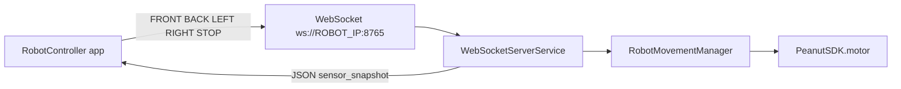

# Remote control (WebSocket) — Sample App extension

> **Source:** Ported from `D:\Walnut_Main_app` (RobotMotion branch), aligned with `D:\RobotController` on the phone.

## Overview

The sample app can host a **WebSocket server** on the robot (port **8765**) so an external Android client (e.g. **RobotController**) can send movement commands. A dashboard activity shows IP, server/client status, diagnostics, and logs.

## Components

| Piece | Role |
|-------|------|
| `ReceiverActivity` | UI: start/stop server, status, sensor snapshot panel |
| `WebSocketServerService` | Foreground service: Java-WebSocket server, broadcasts status |
| `RobotMovementManager` | Same motor pattern as `MotorDemo` (MFG_TEST, unlock, `motor().manual` loop, release) |
| `CommandParser` | Maps strings → `ApiConstants.MotorMove` (FRONT/BACK/LEFT/RIGHT/STOP) |
| `SensorDataManager` | Subscribes to SDK topics, emits ~5 Hz unified JSON to connected clients |
| `SdkBootstrap` | Ensures `PeanutSDK` init when only the service runs (e.g. after boot) |
| `BootStartReceiver` | Optional: starts the service on `BOOT_COMPLETED` |

## Flow (RobotController → robot)



## Protocol

- **Port:** `8765` (constant `WebSocketServerService.WS_PORT`).
- **Motion commands (text):** `FRONT`, `FORWARD`, `BACK`, `BACKWARD`, `LEFT`, `RIGHT`, `STOP` (case-insensitive). Unknown commands get `ERR:UNKNOWN_COMMAND:…`.
- **Welcome:** server may send `CONNECTED:ROBOT_RECEIVER_READY`.

### Camera (RemoteController `CameraActivity`)

Uses the **same WebSocket URL** (often a **second** connection while the main screen stays connected for motion). The sample app implements:

| Client sends | Server responds |
|----------------|-----------------|
| `CAMERA_INFO` | `CAMERA_INFO:count=N` (Android `Camera.getNumberOfCameras()`) |
| `CAMERA_START:<id>` | `ACK:CAMERA_START:<id>` then JSON frames (below) |
| `CAMERA_SWITCH:<id>` | `ACK:CAMERA_SWITCH:<id>` then JSON frames |
| `CAMERA_STOP` | `ACK:CAMERA_STOP` (stops capture) |

**Frame payload** (string message, JSON object):

```json
{"type":"camera_frame","camera_id":0,"width":640,"height":480,"jpeg":"<base64 JPEG>"}
```

Implementation: `RobotCameraStreamer` (Camera1 preview → NV21 → JPEG → Base64). Grant **Camera** permission to the sample app (requested with other permissions from `KeenonApiDemoMain` on Android 6+). If the device has fewer than four cameras, IDs with no hardware return `ERR:CAMERA_OPEN:<id>`.

## Entry point in UI

**Home** tab demo list → **Remote Control Receiver** → open `ReceiverActivity` → **Start Server**.

## Permissions

`FOREGROUND_SERVICE`, `RECEIVE_BOOT_COMPLETED` (boot autostart is optional; disable the receiver in manifest if undesired).

## Build note (NDK)

`app/build.gradle` sets `ndkVersion` to match the strip step with an NDK installed under Android SDK (e.g. `27.1.12297006`). If Gradle reports **No version of NDK matched**, install that NDK in Android Studio SDK Manager or change `ndkVersion` to a version you have locally.

Debug APK output: `SampleApp/app/build/outputs/apk/debug/app-debug.apk` after `gradlew :app:assembleDebug`.

---

*See also:* [doc/README.md](../doc/README.md) (documentation index), [HARDWARE_FLOWCHART.md](../doc/HARDWARE_FLOWCHART.md) (architecture flowcharts).
