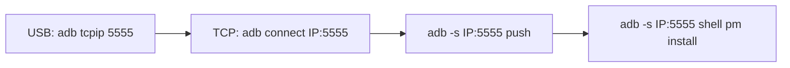
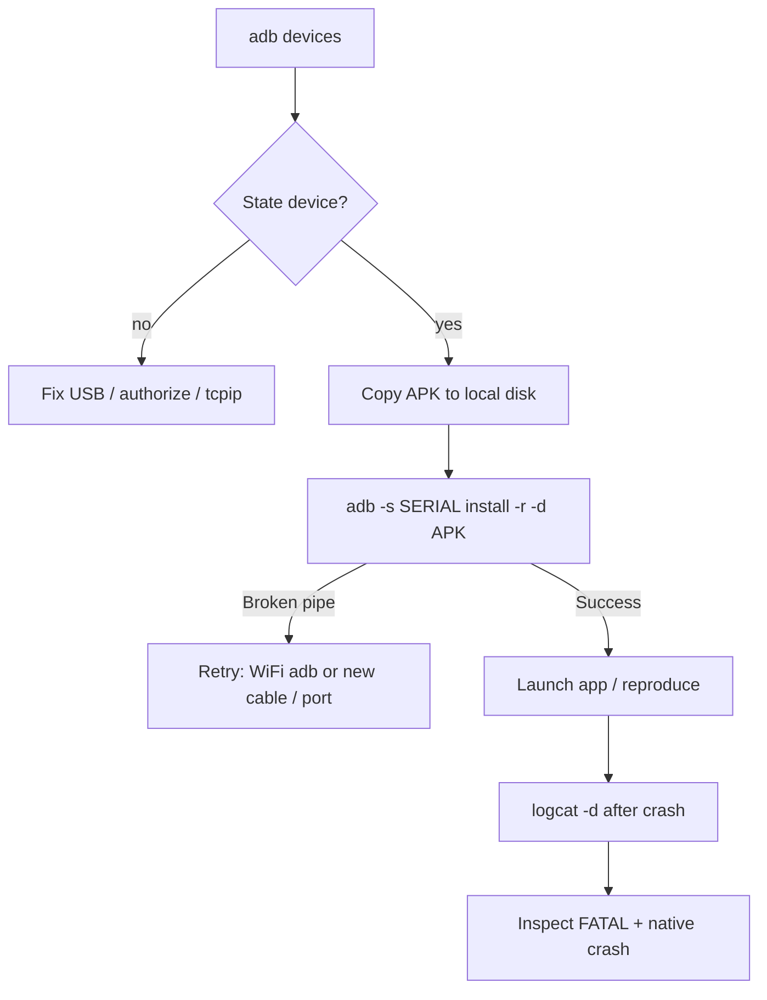

# Robot ADB: multi-device install, push failures, and crash logcat

Sample app package: **`com.keenon.peanut.sample`**.  
Debug APK (typical): **`app/build/outputs/apk/debug/app-debug.apk`** (~220 MB — large transfers stress USB).

## 1. Pick the correct device (not the word `deviceid`)

`adb devices` prints a **serial** column (for example `GFEFQ85Z1G`) and a **state** (`device`, `offline`, `unauthorized`).

```text
adb devices -l
```

Use that serial with **`-s`**:

```powershell
adb -s GFEFQ85Z1G install -r -d "C:\temp\app-debug-sample.apk"
```

- **`-r`** — replace existing app.  
- **`-d`** — allow downgrade (useful when versionCode on device is higher).

**Wrong:** `adb -s deviceid ...` — there is no magic string `deviceid`; you must paste the real serial.

## 2. `65544-byte write failed` or immediate `Broken pipe`

Observed on Windows when pushing a **large** APK (~220 MB): the transfer can fail on an **early chunk** (`65544-byte write failed: No error`) or drop the link (`Broken pipe`). After that, the device may show **`offline`** until you **unplug/replug USB**, unlock the robot, and **re-accept USB debugging**.

**Mitigations:**

1. Copy the APK to **`C:\temp\app-debug-sample.apk`** (short path, not OneDrive).  
2. Run **`adb install` / `adb push` from `cmd.exe`**, not PowerShell (some hosts wrap stdio and confuse ADB).  
3. Use the helper script **`install-sample-to-robot.cmd SERIAL`** from this folder.  
4. If USB keeps dropping, use **Wi‑Fi ADB** (see below) or a different **cable / PC USB port** (avoid unpowered hubs).

### Recovery: `EOF` after “file pushed” but host shows error

Sometimes logcat shows **`1 file pushed`** with the **full byte count** and then **`failed to read copy response: EOF`**, and the PC shows **`offline`**. The payload may still be on the robot under **`/data/local/tmp/`** (install uses names like **`app-debug-sample.apk`** or random tmp names).

After USB reconnects and **`adb devices`** shows **`device`**:

```text
adb -s SERIAL shell "ls -la /data/local/tmp/*.apk 2>/dev/null; ls -la /data/local/tmp | tail"
adb -s SERIAL shell pm install -r -d /data/local/tmp/<the_apk_name_you_see>
```

If no APK remains, run **`push`** again from **`cmd.exe`**, then **`pm install`** in a **second** command (smaller chance of a single long transaction confusing the link).

## 3. Is the APK actually being pushed?

`adb install` first **pushes** the APK to **`/data/local/tmp/`** on the robot, then runs **`pm install`**. If you see:

- `Performing Push Install` then **`Broken pipe`** / **`no response`**

the push **started** but the **USB/adb connection dropped** before the file finished (common with **~200 MB** over a flaky cable, hub, or power-saving USB).

**Checks:**

```powershell
adb -s SERIAL shell "df -h /data; ls -la /data/local/tmp | tail -n 5"
```

If the device flips to **`offline`** after a failed install, unplug USB, revoke USB debugging on the robot (Developer options), replug, accept the RSA prompt, then:

```powershell
adb kill-server
adb start-server
adb devices
```

## 4. More reliable install paths

### A. Copy APK off OneDrive first

Build or copy **`app-debug.apk`** to a **local** folder (for example `C:\temp\`). OneDrive paths can cause partial reads or slow I/O during push.

### B. Two-step: `push` then `pm install` (same as install, but you see the file)

```powershell
adb -s SERIAL push "C:\temp\app-debug-sample.apk" /data/local/tmp/sample.apk
adb -s SERIAL shell pm install -r -d /data/local/tmp/sample.apk
```

If **`push`** fails, try **`/sdcard/Download/`** (sometimes more stable on some builds):

```powershell
adb -s SERIAL push "C:\temp\app-debug-sample.apk" /sdcard/Download/sample.apk
adb -s SERIAL shell pm install -r -d /sdcard/Download/sample.apk
```

### C. Root on the robot (you have `su`)

After a successful **`adb push`** to a path the **`shell`** user can read:

```text
adb -s SERIAL shell su -c "pm install -r -d /data/local/tmp/sample.apk"
```

Or copy as root if permissions are odd:

```text
adb -s SERIAL shell su -c "cp /sdcard/Download/sample.apk /data/local/tmp/sample.apk && chmod 644 /data/local/tmp/sample.apk && pm install -r -d /data/local/tmp/sample.apk"
```

### D. Wi‑Fi / LAN ADB (recommended when USB goes `offline` after big `push`/`install`)

Large APK transfers over **USB** can reset the link on some RK boards. **TCP ADB over the same LAN** usually stays **`device`** for `push` + `pm install`.

#### One-time setup (USB must show `device` once)

1. On the **robot**: **Settings → Developer options → USB debugging** ON. Connect **USB** until `adb devices` shows **`device`** (not `offline`).
2. Find the robot’s **LAN IP** (Wi‑Fi settings on robot, or router DHCP list), e.g. `192.168.1.50`.
3. On the **PC** (Command Prompt is fine):

```text
adb tcpip 5555
adb connect 192.168.1.50:5555
adb devices -l
```

You should see a line like **`192.168.1.50:5555    device`**.

4. **Unplug USB** (optional but recommended so Windows does not keep toggling the connection). Use **only** the TCP serial for commands:

```text
adb -s 192.168.1.50:5555 push D:\app-debug.apk /data/local/tmp/app-debug.apk
adb -s 192.168.1.50:5555 shell pm install -r -d /data/local/tmp/app-debug.apk
```

Replace **`192.168.1.50`** with your robot’s IP.

#### After a PC or robot **reboot**

`adb tcpip 5555` is often **lost** until USB is attached again **or** the robot runs a persistent script / property (varies by firmware). If `adb connect …` fails after reboot:

- Plug **USB** briefly → `adb tcpip 5555` → `adb connect IP:5555` → unplug again, **or**
- On **rooted** robots, some teams set **`service.adb.tcp.port=5555`** + restart `adbd` once (OEM-specific).

#### Reliability tips

| Tip | Why |
|-----|-----|
| **DHCP reservation / static IP** for the robot | `adb connect` target must not change every day |
| **PC firewall**: allow **adb.exe** / outbound to port **5555** | Otherwise `connect` hangs or drops |
| **Same subnet** (PC Wi‑Fi/Ethernet same LAN as robot) | No client isolation on guest Wi‑Fi |
| Use **`push` + `pm install`** in two commands | Same as USB; avoids `adb install` EOF on huge APKs |
| **`adb disconnect`** when switching robots | Clears stale TCP sessions |

```text
adb disconnect 192.168.1.50:5555
adb connect 192.168.1.50:5555
```



**Note:** Nothing can **guarantee** “never offline” if the robot reboots, Wi‑Fi drops, or `adbd` crashes — but **LAN ADB** removes the fragile **USB bulk** path that was causing your disconnects.

## 5. App crashes after install — capture logs

Clear log, reproduce crash (Count → Start Preview), then pull logs:

```powershell
adb -s SERIAL logcat -c
adb -s SERIAL shell am start -n com.keenon.peanut.sample/.MainActivity
REM … reproduce crash …
adb -s SERIAL logcat -d -v time > crash-log.txt
```

Filter locally (PowerShell):

```powershell
Select-String -Path crash-log.txt -Pattern "FATAL|AndroidRuntime|CountFragment|TrayPlateCounter|mediaserver|DEBUG|libc"
```

Share the **first `FATAL EXCEPTION`** block and any **`signal 11`** / **`mediaserver`** lines.

## 6. Flow (install vs crash)



## 7. Build debug APK (SampleApp)

From the **`SampleApp`** folder (Windows):

```powershell
Set-Location "…\peanut-sdk-v1.3.0\SampleApp"
.\gradlew.bat assembleDebug --no-daemon
```

Output APK:

`app\build\outputs\apk\debug\app-debug.apk`  
`applicationId`: **`com.keenon.peanut.sample`**

Copy to **`C:\temp\`** before **`adb install`** if USB push is flaky (see §2).


