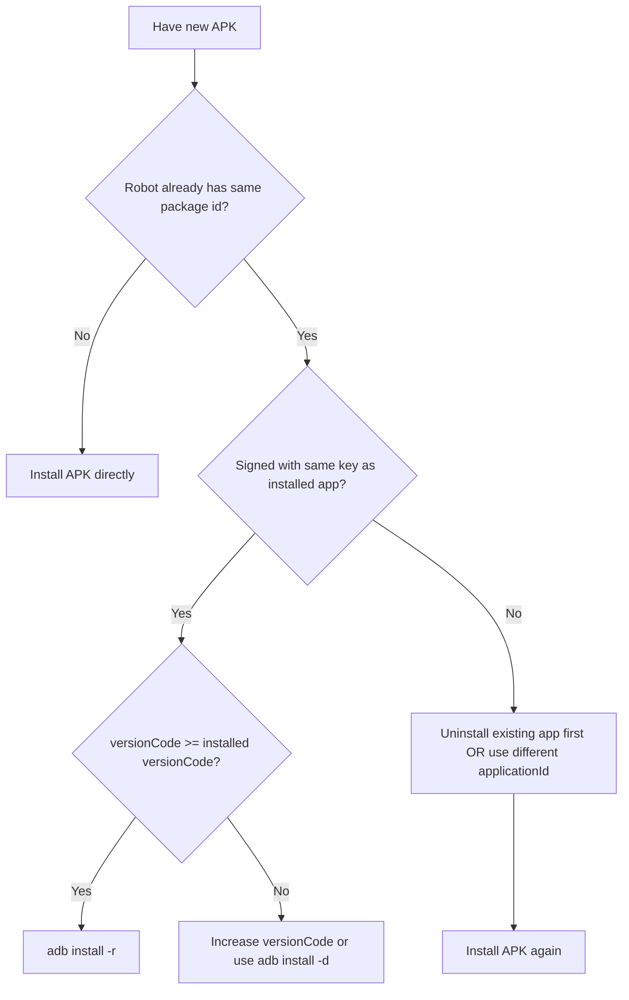
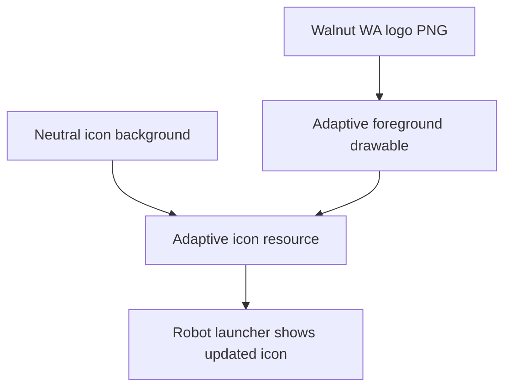
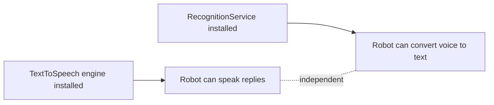
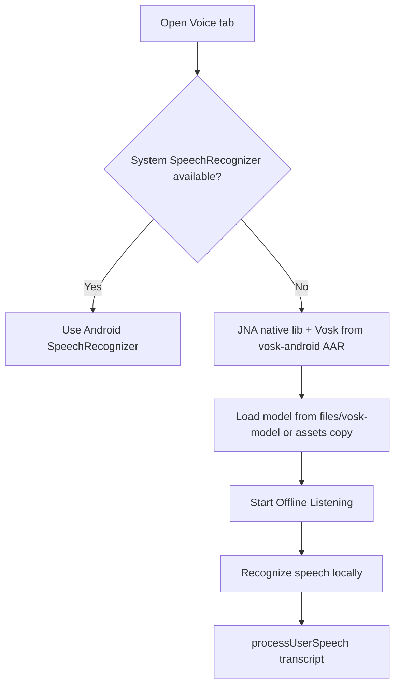

# Robot Installation Environment and Compatibility Guide

## Purpose

This document records the exact environment in which the current `SampleApp` installs successfully on the robot, and explains why installation can fail after version/config changes.

## Known Working Installation Scenario

- App source: `peanut-sdk-v1.3.0/SampleApp`
- Build type used for robot update: APK installed manually from USB/PC
- Existing package name: `com.keenon.peanut.sample`
- Robot install method that worked:
  - Initial sample APK from pendrive installed and launched successfully
  - Re-installing changed APK required uninstalling the older app first

## Critical Compatibility Baseline

Keep these aligned with the current project unless there is a deliberate migration plan:

| Area | Current baseline |
|---|---|
| Android Gradle Plugin | `4.0.1` |
| Gradle wrapper | `6.1.1-all` |
| compile SDK | `29` |
| target SDK | `29` |
| min SDK | `19` |
| Build tools | `29.0.3` |
| App id | `com.keenon.peanut.sample` |

## Why Installation Fails Quickly

Fast install failures usually happen before app launch. Most common reasons:

1. Signature mismatch (`INSTALL_FAILED_UPDATE_INCOMPATIBLE`)
   - Existing app on robot is signed with a different key than the new APK.
   - Typical case: previously installed release-signed APK, then trying `app-debug.apk`.

2. Version downgrade (`INSTALL_FAILED_VERSION_DOWNGRADE`)
   - New APK has lower `versionCode` than installed app.

3. ABI mismatch (`INSTALL_FAILED_NO_MATCHING_ABIS`)
   - APK/native libs do not match robot CPU architecture.

4. Parsing/storage issues
   - Corrupt APK, incomplete transfer, or low storage.

## Rule of Thumb for Version/Config Changes

Version-related changes can cause failure **if** they alter compatibility assumptions.

- `Yes, likely to fail` when changing:
  - signing key
  - package name update path expectations
  - `versionCode` direction (downgrade)
  - ABI packaging
  - SDK/toolchain combination beyond robot-supported runtime

- `Usually safe` when changing:
  - internal Java/Kotlin logic only (UI/form/voice logic),
  - while keeping signing, package id, and install/update path consistent.

## Installation Decision Flow



## Recommended Install Commands (PC -> Robot)

Use Android SDK `adb.exe`:

```powershell
$adb = "$env:LOCALAPPDATA\Android\Sdk\platform-tools\adb.exe"
& $adb devices
```

Expected device state should be `device` (not `offline`).

Install:

```powershell
& $adb install -r "D:\...\app-debug.apk"
```

If signature conflict:

```powershell
& $adb uninstall com.keenon.peanut.sample
& $adb install "D:\...\app-debug.apk"
```

## App Icon Branding Update

The app launcher icon has been updated to the Walnut WA branding.



## Voice Tab Limitation on Robot
 
Voice input uses two pipelines, chosen automatically:

- **Android `SpeechRecognizer`:** if available on the robot.
- **Offline Vosk:** only when `SpeechRecognizer` is missing.

On some robots, `SpeechRecognizer` is unavailable, and the UI may show:

`Speech recognition is not available on this device.`

This is a device capability/service issue, not just a permission issue.

### What to do

1. Verify robot has any speech recognition engine/service installed.
2. Ensure robot is online if engine requires cloud recognition.
3. If service is unavailable on robot firmware, choose one of:
   - integrate vendor-supported voice SDK for this robot model, or
   - implement server-side ASR (record audio and send to backend), or
   - keep text-only input fallback for this device.

## In-App Voice Diagnostic (No ADB Needed)

The Voice tab now includes a built-in diagnostic:

- `Check Voice Support` button
- `Voice engine` status text
- automatic capability check when Voice tab opens

### Diagnostic flow in app

```mermaid
flowchart TD
    A[Open Voice tab] --> B{SpeechRecognizer available?}
    B -- Yes --> C[Use Android SpeechRecognizer]
    C --> D[Enable Hold to Speak]
    B -- No --> E[Offline fallback mode enabled]
    E --> F[Use local transcript in chat (Vosk offline)]
```

## TTS vs Speech Recognition Clarification

Installing **Google Text-to-Speech** only enables robot speech output (text to voice).  
It does **not** provide Android speech recognition input service.



If your app says `No SpeechRecognizer service found on this robot`, the missing component is a recognition service, not TTS.

## Offline STT Fallback (Implemented)

When `SpeechRecognizer` is unavailable, Voice tab now switches to **offline Vosk** mode:

1. App loads the Vosk model from **`Android/data/<package>/files/vosk-model/`** after you unpack **vosk-model-en-in-0.5** (Indian English, ~1 GB) there (the model is **not** in the APK). Optionally an old internal copy under **`files/model-en-us-lggraph`** from a previous install is still used until removed; when external loads successfully, that legacy folder is deleted to save space.
2. Tap mic button → start offline listening; tap again → stop
3. **Speak a short phrase, then pause ~1 s** — Vosk finalizes on silence; the listening line shows **partial** text while you talk
4. `AudioRecord` tries **MIC**, **VOICE_COMMUNICATION**, **VOICE_RECOGNITION**, **DEFAULT**, **CAMCORDER** until recording actually starts; PCM is fed to Vosk as **short[]** chunks (~0.2 s), matching the official Vosk Android `SpeechService`
5. Local transcript is passed to chat logic and TTS reply flow

If nothing appears in chat, see **Offline Vosk: nothing seems recognized** in `VOICE_FORM_EXTENSION.md` (Logcat tag `VoiceFragment`, mic permission).



### Configuration required

- File: `app/src/main/java/com/keenon/peanut/sample/VoiceFragment.java`
- **On device:** `Android/data/<package>/files/vosk-model/` with full **`vosk-model-en-in-0.5`**. **In repo:** only `assets/README_VOICE_MODEL.txt` (no model binaries in APK).
- Constants in `VoiceFragment.java`: `VOSK_EXTERNAL_MODEL_FOLDER` = `vosk-model`, `VOSK_LEGACY_INTERNAL_CACHE_DIR` = `model-en-us-lggraph` (legacy name only; deploy **`vosk-model-en-in-0.5`** for Indian English offline STT).
- Vosk dependency in `app/build.gradle`: **`com.alphacephei:vosk-android:0.3.70`** (includes **JNA as AAR** so `libjnidispatch.so` loads on **armeabi-v7a**; use a current `0.3.x` so **`new Model(path)`** matches modern packaged models such as **en-in-0.5**).

### Cold start stability

`ViewPager2` offscreen page limit is set to `1` so **VoiceFragment is not created at app launch**.
That avoids native Vosk crashes when the on-device model is missing or incomplete.
Vosk loads only after you open the Voice tab, and only if a valid tree exists under `files/vosk-model/` (or legacy internal cache).

