# Voice + Form UI Extension — Documentation

## Overview

The Keenon SDK Sample app has been extended with a tabbed UI. The original home screen
is preserved as-is on the **Home** tab, and two new tabs have been added:

- **Form tab** — A delivery/contact request form with runtime Backend IP/URL, Name, Phone, Destination, and Message fields.
- **Voice tab** — A voice chat interface where the user can speak to the robot and receive spoken + text replies.

---

## Voice routing policy (online vs offline)

| Condition | Engine |
|-----------|--------|
| **Internet available** (per `ConnectivityManager`) and runtime backend URL in **`BackendConfig`** | **Java backend (preferred)** — record WAV (PCM 16-bit mono 16 kHz), `POST` **`/speech-transcribe`** to Spring Boot (`java-backend`); Whisper on the server. Same path for **Developer → Voice** and **retail voice tab** when this condition holds. Button: **Tap to Speak** |
| **Internet available**, Java backend **not** selected (e.g. no URL), and `SpeechRecognizer.isRecognitionAvailable()` | **SpeechRecognizer** — OEM/cloud recognizer when the device exposes `RecognitionService` |
| **No online path** and Vosk model loaded (**VoiceFragment** only) | **Vosk** offline — bundle **`vosk-model-small-en-in-0.4`** under **`app/src/main/assets/vosk-model-small-en-in-0.4/`** (preferred), or deploy under `vosk-model/` on device (see `assets/README_VOICE_MODEL.txt`) |

**Three-word limit:** after STT, the app keeps only the **first three whitespace-separated words** of the transcript for `processUserSpeech()` (FAQ triggers in **PromoVoiceFragment**, intents in **VoiceFragment**).

The backend URL is **runtime + persistent** in `SharedPreferences` (`BackendConfig`): user enters IP/URL in the **Form tab**, app normalizes/saves it, and Form submit (`/form-submit`), promo endpoints (`/promo-interest`, etc.), and **`/speech-transcribe`** all use that same saved value.

The Voice tab uses **`ConnectivityManager`** via **`VoiceBackendHelper`** to decide the path. **API 24+** registers a default network callback; **API 19–23** rely on **`onResume()`** to refresh. Mic tap: **Java backend** → `JavaBackendSpeechTranscriber` (stops after ~550 ms silence following speech, capped at 12 s) → `processUserSpeech()`; **else system online** → `SpeechRecognizer.startListening`; **else** → `toggleOfflineListening()` (Vosk). Cleartext HTTP to LAN is allowed via `android:usesCleartextTraffic="true"`.

The optional Python **`pc-backend`** prototype is **removed** from the tree; use **`java-backend`** only.

The Voice tab now also shows a live diagnostic line:
- `Recognizer: Yes/No`
- `Network: Connected/Disconnected`
- `Mode: Online/Offline` (and `Online Listening` while active)

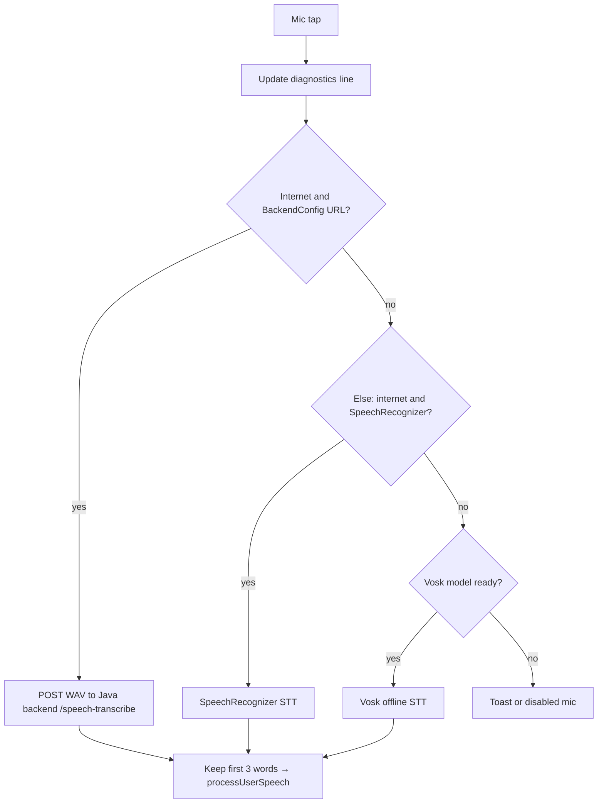

---

## Architecture Flowchart

```
KeenonApiDemoMain (Activity)
        │
        ├── main.xml  ──► SDK Status Bar + TabLayout + ViewPager2
        │
        ├── SDK Initialization (PeanutSDK.init in Activity)
        │       ├── PeanutConfig: appId, secret, linkType, linkIP
        │       ├── PeanutRuntime.start() on success
        │       └── SDK release on Activity destroy
        │
        ├── Tab 0: HomeFragment
        │       ├── fragment_home.xml
        │       ├── Positioning mode checkboxes (Laser / Label)
        │       │       └── Calls activity.reinitSDK() on change
        │       └── ListView ──► BaseDemo / ChassisList
        │
        ├── Tab 1: FormFragment
        │       ├── fragment_form.xml
        │       ├── Fields: Backend IP/URL, Name, Phone, Destination, Message
        │       ├── Saves backend URL at runtime (SharedPreferences)
        │       ├── Validation (Name + Destination required)
        │       └── Submit ──► POST /form-submit (uses entered backend URL)
        │
        └── Tab 2: VoiceFragment
                ├── fragment_voice.xml
                ├── item_chat_bubble.xml  (user blue / robot grey bubbles)
                ├── In-app voice diagnostic (no ADB)
                │       ├── Check Voice Support button
                │       ├── Voice engine availability label
                │       └── Auto-check when tab opens
                ├── Online STT (Java backend, preferred): internet + saved backend URL  ──► WAV POST /speech-transcribe ──► processUserSpeech() (first 3 words)
                ├── Online STT (system): else internet + SpeechRecognizer  ──► onResults ──► processUserSpeech() (first 3 words)
                │       └── Mic-open guard: stop stale listeners, retry AudioRecord once (~250 ms), show actionable toast when mic is busy
                ├── Offline STT: no online path  ──► Vosk (`toggleOfflineListening`)
                │       ├── Resolve model: (1) copy APK assets `vosk-model-small-en-in-0.4` → internal files once; else BFS under vosk-model (depth ≤8); graph must contain real .fst → Vosk native Model()
                │       ├── AudioRecord PCM @ 16 kHz mono (same as org.vosk.android.SpeechService: short[] chunks ~0.2 s)
                │       ├── Input order: MIC → VOICE_COMMUNICATION → VOICE_RECOGNITION → DEFAULT → CAMCORDER
                │       ├── Listening line shows mic level % + partial text; final phrase after a short pause
                │       └── Parse local transcript and continue chat flow
                ├── TextToSpeech  ◄──── speak(reply); AudioAttributes USAGE_ASSISTANT/MEDIA + CONTENT_TYPE_SPEECH (API 21+), else STREAM_MUSIC bundle (API 19–20)
                └── Intent Refinement + Chat
                        ├── Normalize transcript (lowercase + remove punctuation)
                        ├── Local math parsing (safe Java regex)
                        ├── "charging/charge/charger" / "go to charging"  →  TTS "Opening charging." then `ChargerDemo` + `CHARGE_ACTION_AUTO` after utterance completes
                        ├── "hello/hi/hey"             →  "Hello! How can I help you today?"
                        ├── "how are you"              →  "I am fully charged and ready to serve!"
                        ├── "your name"                →  "I am your Keenon robot assistant!"
                        ├── "bye/goodbye"              →  "Goodbye! Have a great day!"
                        └── anything else            →  "I heard: \"...\". Try saying: charging, home, hello."
```

---

## Build Configuration (Robot-Compatible)

The SampleApp is configured to match the **original Peanut SDK v1.3.0 Sample** build settings
to ensure compatibility with the Keenon robot hardware.

### Build configuration summary

| File | Key Setting |
|------|------------|
| `build.gradle` (root) | AGP `4.0.1`, repos: `google()` + `jcenter()` + `mavenCentral()` |
| `gradle/wrapper/gradle-wrapper.properties` | Gradle `6.1.1-all` |
| `app/build.gradle` | `compileSdkVersion 29`, `minSdkVersion 19`, `targetSdkVersion 29`, `buildToolsVersion "29.0.3"`, `vosk-android:0.3.70` (JNA packaged as AAR for `libjnidispatch.so` on arm) |
| `AndroidManifest.xml` | `requestLegacyExternalStorage="true"`, icon: `@mipmap/ic_launcher`, `roundIcon: @mipmap/ic_launcher_round` |

### Branding update (Walnut WA logo)

- Launcher icon foreground is now sourced from: `@drawable/logo_wa_walnut`
- Adaptive icon foreground file: `app/src/main/res/drawable-v24/ic_launcher_foreground.xml`
- Adaptive icon background file: `app/src/main/res/drawable/ic_launcher_background.xml`

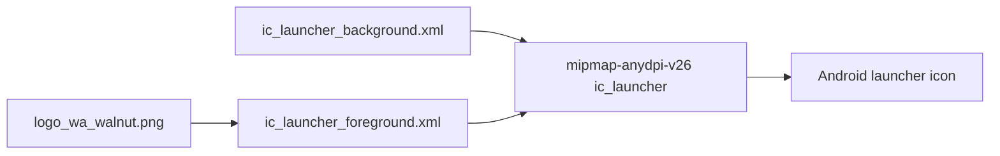

### Why these versions?

- **`compileSdkVersion 29`**: Matches the original SDK sample; required for `requestLegacyExternalStorage`.
- **`targetSdkVersion 29`**: Matches the original SDK sample; ensures proper behavior on the robot's Android OS.
- **`minSdkVersion 19`**: Matches the original SDK sample; broadest device compatibility.
- **No NDK ABI filters**: Removed to allow installation on all CPU architectures (robot + dev devices).

### Dependency versions

| Library | Version | Notes |
|---------|---------|-------|
| `androidx.appcompat` | `1.2.0` | Matches original SDK sample |
| `androidx.constraintlayout` | `1.1.0` | Matches original SDK sample |
| `androidx.viewpager2` | `1.0.0` | Added for tab UI |
| `com.google.android.material` | `1.1.0` | Added for TabLayout |
| `androidx.fragment` | `1.2.5` | Supports `FragmentStateAdapter` for ViewPager2 |
| `androidx.multidex` | `2.0.1` | Required for multidex |
| `butterknife` / compiler | `10.2.3` | Stable |
| `fastjson` | `1.2.68` | Alibaba JSON |
| `gson` | `2.8.6` | Google JSON |
| `slf4j-api` | `1.7.25` | Logging facade |
| `leakcanary-android` (debug) | `2.5` | Debug-only memory leak detector |
| `umeng common` / `asms` | `9.4.0` / `1.2.3` | Analytics |

---

## SDK Initialization Flow

SDK initialization is now handled at the **Activity level** in `KeenonApiDemoMain`:

1. `onCreate()` → calls `initSDK()` with the saved link type (Laser/Label preference)
2. On success → `PeanutRuntime.getInstance().start()` connects to the robot
3. SDK status is displayed in the status bar at the top of the screen
4. `onDestroy()` → calls `PeanutSDK.getInstance().release()`
5. `HomeFragment` can trigger `reinitSDK()` when the user switches between Laser/Label modes

This ensures the SDK is always initialized regardless of which tab is active.

---

## Files Changed / Added

### Modified
| File | Change |
|------|--------|
| `build.gradle` (root) | Restored `jcenter()` alongside `mavenCentral()` |
| `app/build.gradle` | Restored `compileSdkVersion 29`, `targetSdkVersion 29`, `minSdkVersion 19`, removed NDK ABI filters |
| `app/src/main/AndroidManifest.xml` | Restored `requestLegacyExternalStorage`, `@mipmap/ic_launcher`, added `RECORD_AUDIO` + `ACCESS_WIFI_STATE` permissions |
| `app/src/main/res/layout/main.xml` | SDK status bar + TabLayout + ViewPager2 (tab strip: white bar, dark grey / indigo selected text, primary indicator; see `tab_text_selector`, `TabLabelText`) |
| `app/src/main/java/.../KeenonApiDemoMain.java` | Tab host + SDK initialization + release lifecycle |

### Created
| File | Purpose |
|------|---------|
| `app/src/main/java/.../HomeFragment.java` | Tab 0: positioning mode toggle + demo list |
| `app/src/main/java/.../FormFragment.java` | Tab 1: delivery request form |
| `app/src/main/java/.../VoiceFragment.java` | Tab 2: voice chat with SpeechRecognizer + TTS |
| `app/src/main/java/.../util/DeviceProxy.java` | SDK init wrapper with mock mode fallback |
| `app/src/main/res/layout/fragment_home.xml` | Home tab layout |
| `app/src/main/res/layout/fragment_form.xml` | Form tab layout |
| `app/src/main/res/layout/fragment_voice.xml` | Voice tab layout |
| `app/src/main/res/layout/item_chat_bubble.xml` | Single chat message row (user vs robot) |
| `app/src/main/res/drawable/ic_launcher_fallback.xml` | Fallback launcher icon vector drawable |

---

## How to Use

### Home Tab
1. Open the app — SDK initializes automatically.
2. The green status bar shows SDK version and init result.
3. Switch between **Laser** and **Label** positioning modes.
4. Tap a demo item (Base Demo / Chassis List) to navigate.

### Form Tab
1. Tap the **Form** tab.
2. Fill in Backend IP/URL, Name, Phone (optional), Destination, and Message.
3. Tap **Submit Request**.
4. A confirmation toast and result message are shown. Submission is logged to Logcat under tag `FormFragment`.

### Voice Tab
1. Tap the **Voice** tab.
2. The app checks **network + SpeechRecognizer** and loads **Vosk** in the background for offline use.
3. Optionally tap **Check Voice Support** to retry offline model setup or refresh status.
4. Grant microphone permission when prompted.
5. **Online:** Tap **Hold to Speak** and speak (Google cloud STT when connected). **Offline:** Tap **Start Offline Listening** (Vosk) once the model is ready.
6. The robot replies in both text bubbles and spoken TTS audio.
7. **Logcat (online STT only):** Filter `adb logcat` by tag `VoiceFragment` at level **Info**. When the **online** path runs, the app logs: `Voice listening: speech is processed by Google speech recognition (cloud) via SpeechRecognizer`.

#### Voice engine diagnostic flow

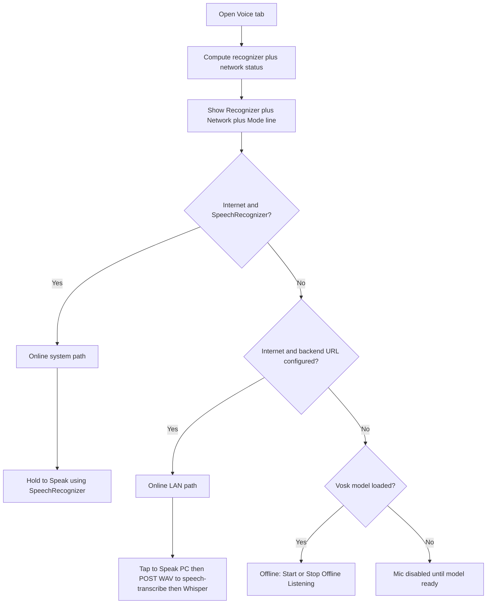

#### Supported phrases
| You say | Robot replies |
|---------|--------------|
| Charging / charge / charger / go to charging | Speaks "Opening charging." then opens **ChargerDemo** with **auto charge** started (same as Auto charge button; after TTS finishes; debounced) |
| Hello / Hi / Hey | "Hello! How can I help you today?" |
| How are you | "I am fully charged and ready to serve!" |
| What is your name / Who are you | "I am your Keenon robot assistant!" |
| Bye / Goodbye | "Goodbye! Have a great day!" |
| Anything else | "I heard: \"[your words]\". Try saying: charging, home, hello." |

#### Charging intent: speak then navigate

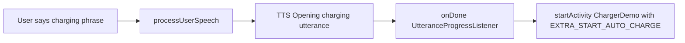

Replies use the **application** `TextToSpeech` instance with **loudspeaker-friendly** routing so output is not tied to the earpiece stream on robot tablets.

---

## Dependencies Added

```groovy
implementation 'androidx.viewpager2:viewpager2:1.0.0'
implementation 'com.google.android.material:material:1.1.0'
implementation 'androidx.fragment:fragment:1.2.5'
```

Voice input uses one of these pipelines (mutually exclusive by network + availability):
- **Android `SpeechRecognizer`:** when **internet is available** and `SpeechRecognizer` is available (typically Google cloud STT on GMS devices)
- **Offline Vosk:** when **offline** or `SpeechRecognizer` is missing; use a small on-device model such as **`vosk-model-small-en-in-0.4`**

All pipelines use Android `TextToSpeech` for spoken replies, with **speaker-oriented audio** (`setAudioAttributes` on API 21+, `KEY_PARAM_STREAM` + `STREAM_MUSIC` on API 19–20).

---

## Form Backend Integration (Spring Boot)

- Android sender: `FormFragment` -> runtime URL entered in Form tab (defaults to `BackendConfig.BASE_URL`)
- Backend receiver: `java-backend` Spring Boot app (`/form-submit`)
- Required request fields: `name`, `destination` (server validates and returns `400` when missing)
- Persistence: backend appends each accepted payload to `java-backend/submissions.ndjson`

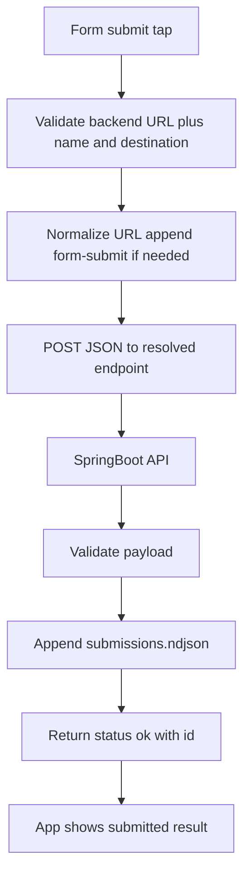

Example payload:

```json
{
  "name": "Alice",
  "phone": "9999999999",
  "destination": "Room 203",
  "message": "Bring charger",
  "submittedAt": "1712500000000"
}
```

---

## Building (clean + debug APK)

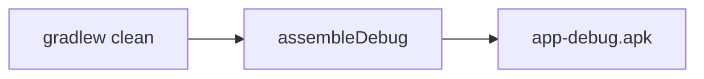

From the `SampleApp` folder in PowerShell:

```powershell
Set-Location "D:\OneDrive - Waaree Energies Limited\peanutMaster_nochange\peanut-sdk-v1.3.0\SampleApp"
.\gradlew.bat clean assembleDebug --no-daemon
```

**Debug APK output path:**

`peanut-sdk-v1.3.0\SampleApp\app\build\outputs\apk\debug\app-debug.apk`

For a **release** APK (requires `signing.properties` or Android Studio signing setup):

```powershell
.\gradlew.bat clean assembleRelease --no-daemon
```

Output: `app\build\outputs\apk\release\app-release.apk` (unsigned unless signing is configured).

---

## Notes

- **Online vs offline:** The app **does not** use `SpeechRecognizer` when there is no internet; it switches to **Vosk** so behaviour matches “good when online / use small model offline.” When online, `SpeechRecognizer` on GMS devices typically uses **Google cloud** recognition.
- Installing a TTS engine (for example Google Text-to-Speech) only affects spoken output. Voice input still requires an Android `RecognitionService` implementation.
- **STT vs TTS:** Offline recognition follows the **Vosk model** you deploy (here **Indian English `vosk-model-en-in-0.5`**). Spoken replies use Android **TextToSpeech** with **`Locale.US`** in `VoiceFragment.initTts()` — you can change TTS locale independently of the Vosk model.
- If `RecognitionService` is missing, this app falls back to **Vosk offline STT**. **Bundled models (recommended):** add **`vosk-model-small-en-in-0.4`** under **`app/src/main/assets/vosk-model-small-en-in-0.4/`** (`am/`, `conf/`, `graph/`, `ivector/`); the app copies it to **`files/vosk-bundled-model/`** on first run and loads from there. **Resolution order:** **(1)** bundled assets copy, **(2)** `Android/data/<package>/files/vosk-model/`, **(3)** `/data/data/<package>/files/vosk-model/` (adb), **(4)** legacy `files/model-en-us-lggraph`. Under each root, **BFS** (depth up to 8) finds a valid tree. `graph/` must contain a **real `.fst`**. See `assets/README_VOICE_MODEL.txt`.
- `KeenonApiDemoMain` uses `ViewPager2.setOffscreenPageLimit(1)` so **VoiceFragment is not preloaded** at cold start; Vosk loads only when you open the Voice tab. `new Model(...)` runs only after `looksLikeVoskModel()` passes (avoids native crash on incomplete trees).

### Large Vosk model in Android data (not in APK)

**You do not create `Android/data/<package>/` by hand.** Install the app, open the **Voice** tab once — Android creates `Android/data/<package>/files/`, and this app creates an empty **`files/vosk-model/`** folder so you can copy the model in.

On **Android 11+**, many PC file browsers cannot see `Android/data/` without **ADB**, the device’s **Files** app (with “Use this folder” grant), or **Wireless debugging / MTP** tools. If the path is missing before install, that is expected.

Unzip **`vosk-model-en-in-0.5`** (Indian English, ~1 GB) so these folders sit **directly inside** `vosk-model`:

`Android/data/com.keenon.peanut.sample/files/vosk-model/am/`  
`Android/data/com.keenon.peanut.sample/files/vosk-model/conf/`  
`Android/data/com.keenon.peanut.sample/files/vosk-model/graph/`  
`Android/data/com.keenon.peanut.sample/files/vosk-model/ivector/`

Use a file manager on the robot/tablet, ADB `push`, or your deployment tool. No extra storage permission is required for this app-private directory.

When the app **successfully loads** the external `vosk-model`, it **deletes** the legacy internal folder **`/data/data/<package>/files/model-en-us-lggraph`** if it exists (leftover from an older APK) and shows a short toast — this frees internal storage. Your **`Android/data/.../files/vosk-model`** tree is **not** removed.

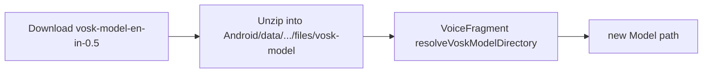

### Background noise and the “signal %” meter

Constant **8–15%** on the old meter was **electronic/ambient noise** scaled to a 0–8000 scale, not “speech”. The app now **calibrates ~0.75 s** after you start listening (stay quiet): it learns a noise peak, subtracts it for the **signal %** display, and **feeds silence to Vosk** when a frame is only slightly above that floor (so fan/hiss is less likely to create junk partials). If speech is too quiet and gets gated, increase distance to the mic or reduce `VOSK_GATE_MARGIN_PCM` / calibration time in `VoiceFragment` (developer tweak).

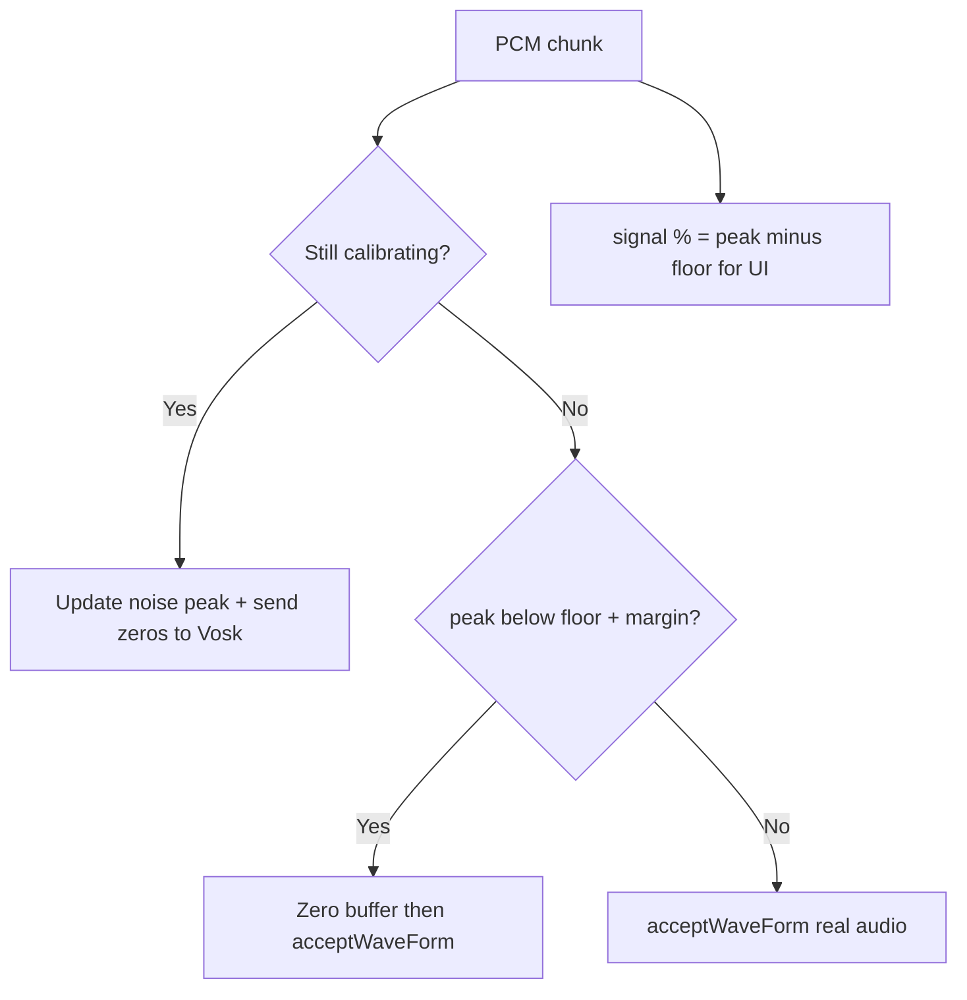
- On the Voice tab, the **mic stays disabled** until offline Vosk is actually loaded (copy + `new Model` can take 1–3 minutes on a slow robot). **Check Voice Support** retries setup if loading failed or stalled.

### Offline Vosk: nothing seems recognized

Vosk only commits a **final** transcript after it detects end-of-utterance (usually a **pause of ~0.5–1 s** after you speak). If you talk continuously without pausing, the UI may look idle even though audio is captured.

1. **Watch the blue listening line** — after calibration it shows **signal N%** (level above the learned noise floor) and partial text when available. If **signal stays 0%** while you talk loudly, check routing/permission/hardware. If only the external model is used and recognition fails, confirm the four folders exist under `files/vosk-model/` and tap **Check Voice Support**.
2. **Engine wiring** — Audio is fed with `Recognizer.acceptWaveForm(short[], nread)` like the official Vosk Android `SpeechService` (PCM shorts, ~0.2 s per read). Dependency: `vosk-android:0.3.70` (newer models such as `vosk-model-en-in-0.5` need a current `libvosk`; older `0.3.47` can fail `Model` construction with valid on-disk trees).
3. If the mic level is non-zero but recognition is still empty: confirm **microphone permission**, reduce noise, speak toward the device mic, and in Logcat look for `Offline mic: using AudioSource=` and `Offline mic: input peak`.
4. **Phrase + pause** — Say *“hello”*, then **stop talking briefly** so Vosk can finalize.
5. If another app is using the mic, close it and tap **Stop** then **Start Offline Listening** again.

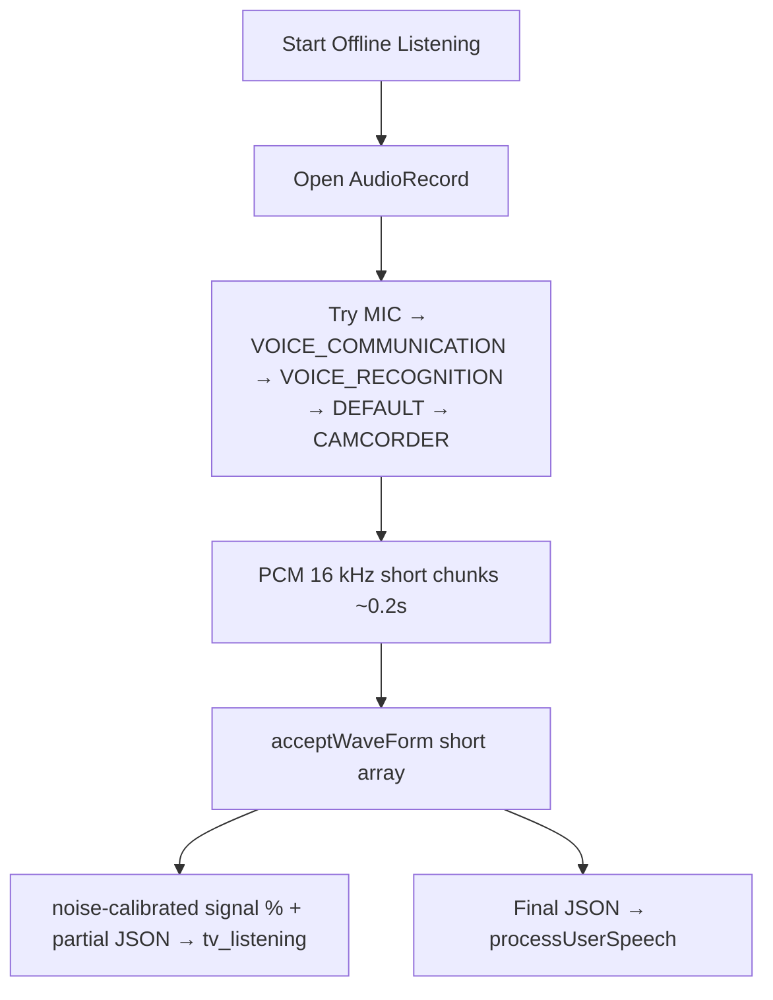
- Form submit now sends JSON to Spring Boot backend (`POST /form-submit`) via `BackendConfig.FORM_SUBMIT_URL`.
- TTS language is set to `Locale.US`. Change this in `VoiceFragment.initTts()` for other languages.
- SDK initialization happens once at Activity startup; the HomeFragment's Laser/Label toggle triggers `reinitSDK()` to reconnect with different link type.

### Cold start vs Voice tab (stability)

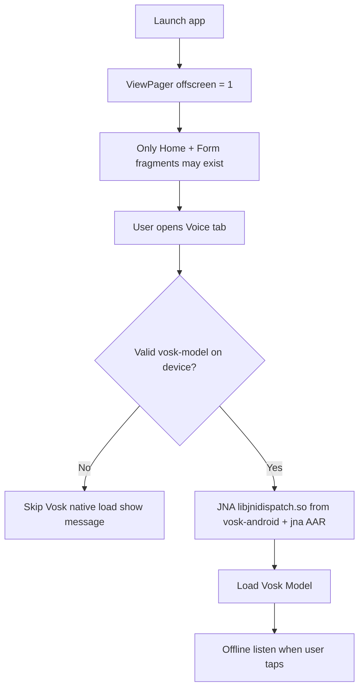

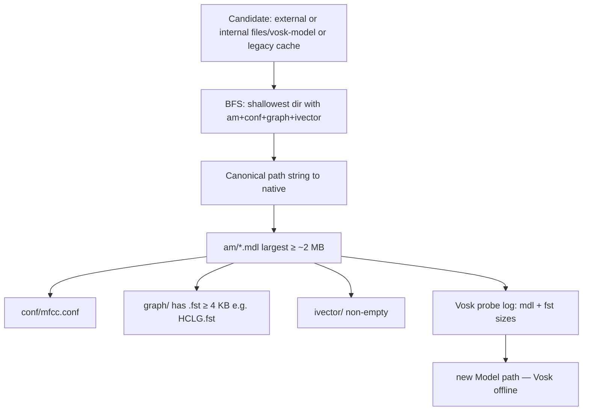

### Offline model error: failed to create / initialize model

If the app reports that the **offline model could not be created** (Vosk `Model` constructor failed):

1. Confirm the **full** **`vosk-model-en-in-0.5`** tree was copied (≈1 GB). Partial MTP/USB copies often leave **`graph/HCLG.fst`** or **`am/final.mdl`** truncated — the toast now includes the **resolved path**; on a PC compare file sizes to a fresh unzip.
2. Under `graph/`, there must be at least one **`.fst`** file that is not a tiny stub (the app requires ≥ 4 KB before calling native code).
3. Extra wrapper folders under `vosk-model/` are OK (search depth up to 8); the Logcat line **`Using nested model folder`** shows which directory was used.
4. Filter **Logcat** by **`VoiceFragment`**: **`Vosk probe`** (`.mdl` / `.fst` sizes), **`Vosk optional dirs`** (`rescore/` / `rnnlm/` byte totals), **`Loading Vosk from`**, and **`Failed to initialize offline recognizer`**.
5. **Memory (common on large models):** Native loading can progress through `am` / `graph` / `ivector` and then fail while loading **`rescore/`** or **`rnnlm/`** (e.g. RNNLM) — see [vosk-api#1401](https://github.com/alphacep/vosk-api/issues/1401). The generic message is still **`Failed to create a model`**. Use **`vosk-model-small-en-in-0.4`** on memory-limited robots, or a device with enough RAM for the full **`en-in-0.5`** package.

### Offline model error: `libjnidispatch.so` not found

If a toast shows **`Native library (com/sun/jna/android-arm/libjnidispatch.so) not found in resource path`**, the Vosk stack could not load **JNA’s** native stub. Older `vosk-android` versions depended on `jna` as a plain JAR, which does not ship Android `.so` files correctly. This project uses **`com.alphacephei:vosk-android:0.3.70`**, which depends on **`net.java.dev.jna:jna` as AAR** so `libjnidispatch.so` is packaged for **armeabi-v7a** / **arm64-v8a** as expected on the robot tablet.
